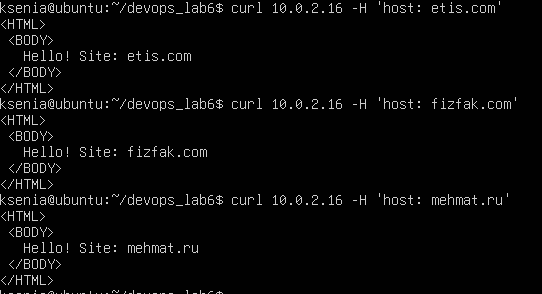
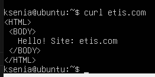
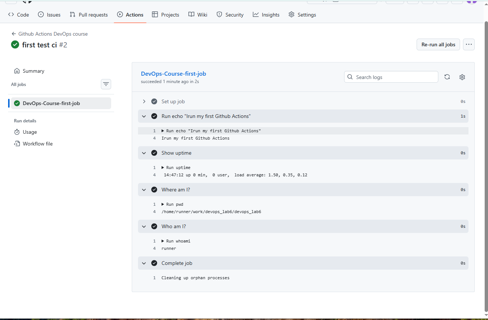
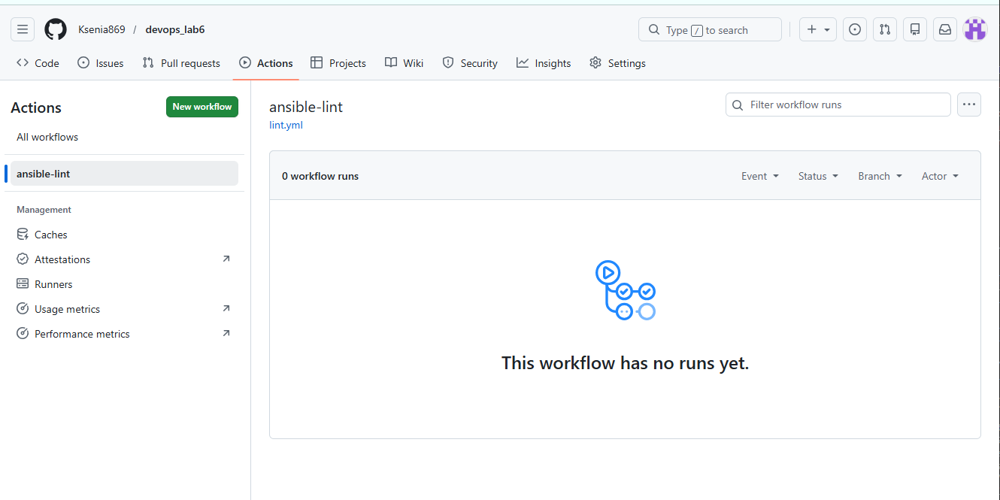

# П07-1. Деплой веб-сервера с помощью role Ansible
1. Сделать role, которая устанавливает nginx c vhosts
2. Роль устанавливает nginx
3. Виртуальные сайты задавать параметрами роли (playbook/play/vars)

Пример:  
var:  
    sites:  
    – mehmat.ru  
    – fizfak.ru  
    – etis.com  
4. Для каждого vhost из шаблона index.html.j2 создавать индексный файл  
5. Для каждого vhost из шаблона {{site}}.conf.j2 создавать конфигурацию веб-сервера  
6. Проверка через curl или браузер с подменой DNS

структура проекта
```
├── inventory.ini
├── playbook.yml
├── run_playbook.sh
├── roles
│    └── nginx-vhosts
│         ├── handlers
│         │    └── main.yml
│         ├── tasks
│         │    └── main.yml
│         ├── templates
│         │    ├── index.html.j2
│         │    └── site.conf.j2
```
inventory.ini
```
[webservers]
10.0.2.16
```
playbook.yml
```
---
- name: Install nginx with Virtual Hosts
  hosts: webservers
  remote_user: runner
  become: true
  become_method: sudo
  gather_facts: no

  vars:
    sites:
    - "etis.com"
    - "fizfak.com"
    - "mehmat.ru"

  roles:
  - nginx-vhosts
```
run_playbook.sh
```
#!/bin/bash +x
ansible-playbook ./playbook.yml -i ./inventory.ini --diff --ask-become-pass

```
tasks/main.yml
```
---
- name: Install nginx
  apt:
    update_cache: True
    name: nginx
    state: latest

- name: Copy nginx config from template
  template:
    src: 'site.conf.j2'
    dest: '/etc/nginx/conf.d/site-{{ item }}.conf'
    owner: root
    group: root
    mode: '0644'
  loop: '{{ sites }}'

- name: Create sites folders
  file:
    path: '/var/www/{{ item }}/'
    state: directory
  loop: '{{ sites }}'

- name: Copy index from template
  template:
    src: 'index.html.j2'
    dest: '/var/www/{{ item }}/index.html'
    owner: root
    group: root
    mode: '0644'
  loop: '{{ sites }}'

- name: Force nginx restart
  systemd:
    name: nginx
    state: restarted
```
index.html.j2
```
<HTML>
 <BODY>
   Hello! Site: {{ item }}
 </BODY>
</HTML>
```
site.conf.j2
```
server {
	listen 80;
	listen [::]:80;

	root /var/www/{{ item }}/;
	index index.html;

	server_name {{ item }};

	location / {
		try_files $uri $uri/ =404;
	}
}
```
Проверка с командной строки



Проверка через браузер


Проверка с одной вм на другую по имени



## П07-2. Добавление функций CI
Создать репозиторий под новый проект
1. В своём профиле на гитлабе создать новый репо
2. Склонировать этот репо к себе на vm командой
git clone
3. Перенести в новый каталог с репо все файлы лабы (плейбуки,
роли, и т.д.)
Добавить функции CI
4. Активировать Actions на стороне github
5. Создать и протестировать CI-пайплайны

Добавляем CI-пайплайны (сценарии)– Github Actions
```
├── inventory.ini
├── playbook.yml
├── run_playbook.sh
├── roles
│    └── nginx-vhosts
│         ├── handlers
│         │    └── main.yml
│         ├── tasks
│         │    └── main.yml
│         └── templates
│              ├── index.html.j2
│              └── site.conf.j2
├── .github
│    └──workflows
│         ├── devops_cource_pipeline.yml
│         └── lint.yml
```
Тестовый сценарий -  смотрим как работает runner на стороне git

devops_cource_pipeline.yml
```
name: Github Actions DevOps course
on: push
jobs:
  DevOps-Course-first-job:
   runs-on: ubuntu-latest
   steps:
    - run: echo "I run my first Github Actions"
    - name: Show uptime
      run: uptime
    - name: Where am I?
      run: pwd
    - name: Who am I?
      run: whoami
```
Добавляем сценарий в гит



сценарий lint.yml
```
name: ansible-lint
on:
  push:
    branches: ["master"]
jobs:
  build:
    name: Ansible Lint
    runs-on: ubuntu-24.04
    steps:
      - uses: actions/checkout@v4
      - name: Run ansible-lint
        uses: ansible/ansible-lint@main
```
проверяем в git

